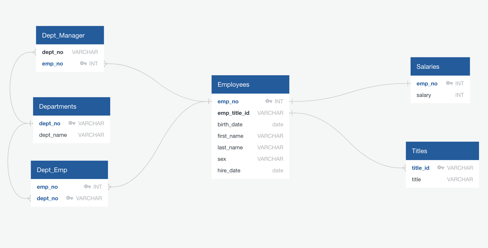

# sql-challenge

## Table of contents
* [General info](#general-info)
* [Objectives](#objectives)
* [Technologies](#technologies)

## General info

In this scenario, I'm an analyst at Pewlett Hackard.  My latest assignment is to analyze employee data from 1980's and 1990's.  This data needs some cleaning up and organizing so let's get started!
	
1) Data Modeling

2) Data Engineering

[Schema](schema_empl.sql)

3) Data Analysis

[Queries](query_analysis.sql)

## Objectives

## Technologies

QuickDBD: https://app.quickdatabasediagrams.com/

pgAdmin4

jupyter notebook